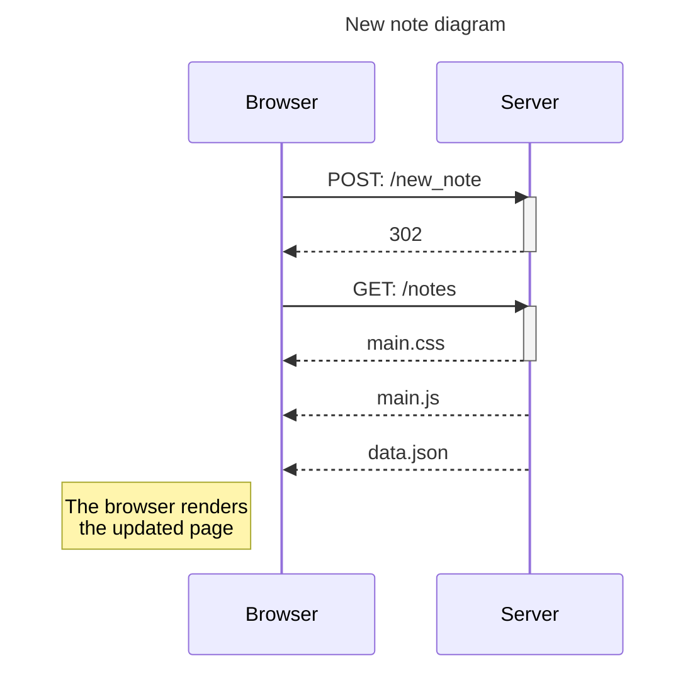

```mermaid
---
title: New note diagram
---
sequenceDiagram
    participant Browser
    participant Server

    Browser->>Server: POST: /new_note
    activate Server
    Server-->>Browser: 302 
    deactivate Server
    Browser->>Server: GET: /notes
    activate Server
    Server-->>Browser: main.css
    deactivate Server
    Server-->>Browser: main.js
    Server-->>Browser: data.json
    Note left of Browser: The browser renders<br/> the updated page 
    
```
