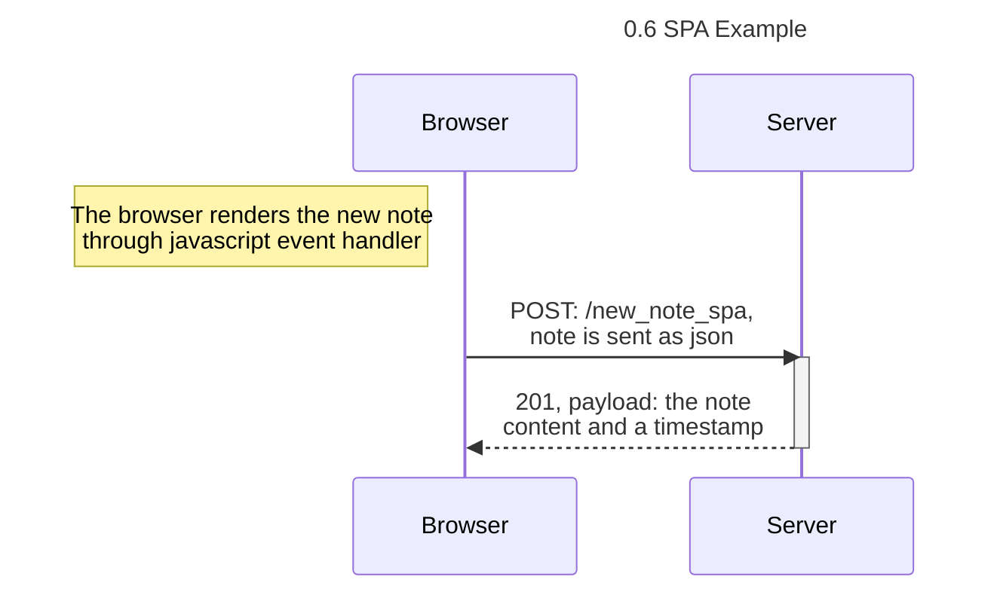

```mermaid
---
title: 0.6 SPA Example
---
sequenceDiagram
    participant Browser
    participant Server

    Note left of Browser: The browser renders the new note <br/> through javascript event handler
    Browser->>Server: POST: /new_note_spa, <br/> note is sent as json
    
    activate Server
    Server-->>Browser: 201, payload: the note <br/> content and a timestamp
    deactivate Server
    
```
